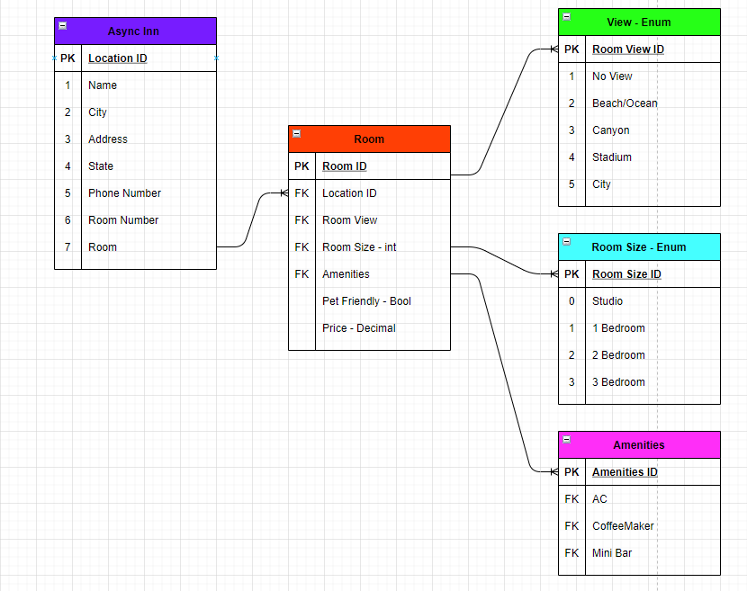

# AysncHotel
## Authors: Qaalid Hashi and Dave Arno
With Help from Miriam Silva and Joel Connell

## Use

To use, make your requests to the site's address (currently only usable locally) the files can be reached at /api/(query) query being hotels, amenities, or rooms.

## Diagram

## Description
Template for this week's labs
### Tables Explantation
Location table creates an ID for each inn with name, city, state, address, phone #, room #, and Room as properties.
Room table creates an individual room ID, takes in a location ID and is connected to ammenities. Room also has room view and size as enums/constants, along with room price and pet friendly status.
View-Enum table connected in room view from Room table, and contains several types.
Room-Size table connected in room size from Room table and contain types.
Amenities table connected in amenities from Room table and contains types.